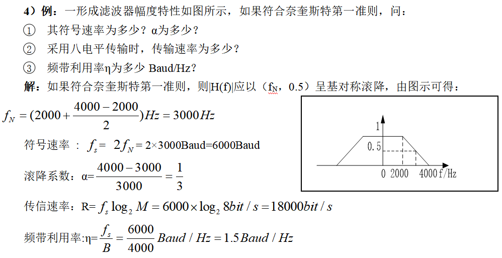

## 分值分布

> 简答题 12 \* 5分 = 50分
>
> 计算题 4题 35 分
>
> 论述题 5分
>
> 数据通信原理：
>
> > 第一章 概述：15分
> >
> > 第二章 数据信号的传输：30分
> >
> > 第三章 差错控制 20分
> >
> > 第四章 数据交换 15分基本概念
> >
> > 第五章 数据通信网络体系结构 15分基本概念
>
> 光纤通信：
>
> > 概念：20分

***

## 知识点

### 第一章（15分

#### 1.数据通信基本概念

1. 数据信号的基本传输方式：**基带传输**、**频带传输**和**数字数据传输**。
2. 常用的二进制代码有：**国际5号码（IA5）**、EBCDIC码和**国际电报2号码（ITA2）**。
3. **国际5号码**，以**7位**二进制码来代表字母、数组或符号。（**ASCII码**）

#### 2.数据通信系统的构成

1. 数据通信系统的基本构成 
   
2. **数据电路**由传输信道及其两端的数据电路终接设备组成。
3. **数据链路**由数据电路加两边传输控制器组成。
4. **DCE是DTE与传输信道的接口设备**。
   1. **基带传输**：DCE是对来自**DTE的数据信号**进行某些**变换**，使信号功率谱与信道相适应，即 使**数据信号**适合在**电缆信道**中传输。
   2. **频带传输**：**DCE具体是调制解调器**，它是调制器和解调器的组合。（发送调制，将对应频带搬移到相应的频带中传输；接收解调，将模拟信号还原成数据信号。
   3. **数字数据传输**：**DCE是数据服务单元**，功能是**信号格式变换**，即 **消除**信号中的**直流**成分 和 **防止长串零**的编码、**信号再生**和**定时**等。

#### 3.数据通信传输信道

1. **数字数据传输信道**：采用**PCM数字信道**作为数据信号传输信道成为数字数据传输信道。
   - 目的：将**模拟信号** 转换成 **数字信号**
2. （了解）传输损耗：信号在传输介质中传播时将会有一部分能量转化成热能或者被传输介质吸收，从而造成信号强度不断减弱，这种现象成为传输损耗（或传输衰减）。

#### 4.数据传输方式

1. 分类
   1. 按数据代码**传输的顺序**可以分为**并行传输**和**串行传输**。
   2. 按数据传输的**同步方式**可分为**同步传输**和**异步传输**。
   3. 按**数据**传输的**流向**和**时间关系**可分为**单工**、**半双工**和**全双工数据传输**。
2. **串行传输**：数据**码流**以串行方式在**一条信道**中**传输**。
   - 优点：易于实现。
   - 缺点：解决收、发双方字符同步，需外加同步措施。
   - 应用场景：**远距离**传输。
3. **并行传输**：将数据以**成组**的方式在**两条以上**的**并行信道**中**同时传输**。
   - 优点：不需要另外措施就实现了收发双发的字符同步。
   - 缺点：需要传输信道多、设备复杂、成本高。
   - 应用场景：计算机和其他**高速数字系统**、**短距离**传输。
4. **异步传输**：每次传送**一个字符**，各字符的**位置不固定**。
   - 优点：实现字符同步比较**简单**、收发双方的时钟信号**不需要精确的同步**。
   - 缺点：每个字符增加了起、止的比特位，**降低**了信息**传输效率**。
   - 应用场景：1200bit/s及以下的**低速**数据传输。
5. **同步传输**：以**固定时钟节拍**来发送数据信号，各字符之间的**相对位置固定**，只需在一串字符流前面加**一个起始**字符，后面加**一个终止**字符，表示字符流的开始和结束。
   - 同步传输一般采用**帧同步**。
   - 比较：相对于异步传输，**技术上要复杂**。但由于只加入了一个起始字符和一个终止字符，为此**传输效率较高**。
   - 应用场景：速率为**2400bit/s及以上**的数据传输。

#### 5.有效性指标（计算、定义）

1. **调制速率**：即符号速率或码元速率，用$N_{Bd}或f_{s}$表示。定义为**每秒传输信号码元的个数**，又称波特率，单位为波特（Baud）
   - 设信号码元持续时间为$T(s)$，那么调制速率$N_{Baud} = \frac{1}{T(s)}(单位：Baud)$。
2. **数据传信速率**：（用$R或f_b$表示）定义是**每秒所传输的信息量**。
   - 当信号为M电平，即M进制时：$R = N_{Bd}log_{2}M(单位：bit/s)$
3. **频带利用率**：**单位频带内的传输速率**。
   - $\eta=\frac{符号速率}{频带宽度}(Baud/Hz)$
   - $\eta = \frac{数据传信速率}{频带宽度}(bit/(s\cdot Hz))$
   - 频带宽度用B表示（后面的信道带宽也是这个）
4. **可靠性指标**：使用差错率来衡量。
   - 差错率一般用**误码率**、误字符率、误码组率来表示。
   - $误码率=接收出现差错的比特数/总的发送比特数$
   - $误字符(码组)率=接收出现差错的字符(码组)数/总的发送字符(码组)数$
5. **信道容量**：信道在**单位时间**内所能传送的**最大信息量**，即 信道的**最大传信率**$(单位：bit/s)$。
   - 香农定律：B为信道带宽，S/N信号功率与噪声功率之比
   - $C=Blog_2(1+\frac{S}{N})$
   - 信噪比：$(S/N)_{db}=10lg(S/N)$ 如：20dB => $lg(S/N) = 2$ => $S/N = 10^2 = 100$
6. **数字信道的信道容量**：根据奈奎斯特准则，带宽为B的信道所能传送的信号**最高码元率**为2B。
   - $C=2Blog_2M$
   - M为电平，即M进制。B为信道带宽

#### 6.多路复用技术

1. 目的：提高**通信信道的利用率**。
2. 方法：**频分复用**、**时分复用**、**波分复用**和**码分复用**。
3. **时分复用（重点：原理）**：时分复用包括一般的时分复用（简称时分复用）和统计时分复用。
   1. **时分复用**：利用各路信号在信道上**占有不同的时间间隔**的特性来**分开各路信号**。
   2. **统计时分复用**：根据用户实际需要**动态地分配线路资源**（逻辑子信道）的方法。

#### 7.数据通信网概述（了解）

1. **数据通信网的构成**：数据通信网是一个由分布在各地的**数据终端设备**、**数据交换设备**和**数据传输链路**所构成的**网络**。

***

### 第二章（30分

#### 1.数据信号及特性描述（画图题

1. **单极性不归零信号**：在**一个码元间隔T**内，脉冲的电位**保持不变**，用正电位表示‘1’码，零电位表示‘0’码，极性单一。不归零信号叫**NRZ**信号。
2. **单极性归零信号**：用宽度为$\tau(\tau < T)$的正脉冲表示‘1’码，用零电位表示‘0’码，极性单一。归零信号叫RZ信号
3. **双极性信号**：用**正**和**负**两个极性的脉冲来表示‘1’码和‘0’码。
   - 双极性信号相比于单极性信号的特点是：在‘1’和‘0’等概率出现的情况下，双极性信号中**不含有直流分量**，为此对**传输信道**的**直流特性没有要求**。
4. **差分信号**：单极性和双极性信号称为绝对码信号。差分信号是用前后码元电位**改变表示信号‘1’**，**电位不变代表信号‘0’**，设**初始状态为零电位**。（规则可相反）
5. **多电平信号**：**多个二进制**代码对应**一个脉冲码元**。如：00对应+3A，01对应+A，10对应-A，11对应-3A。
   - 采用多电平传输，可以在相同的码元速率下**提高信息传输速率**。
     
6. 基带数据信号的功率谱特性
   1. 单极性信号：既有连续谱 又有离散谱
   2. 双极性信号：只有连续谱
   3. 不归零信号：第一个零点$f_B = \frac{1}{\tau} 其中(\frac{1}{\tau}=\frac{1}{T}=f_B)$
   4. 归零信号：第一个零点$2f_B=\frac{1}{\tau}其中(\frac{1}{\tau}=\frac{2}{T}=2f_B)$

#### 2.数据信号的基带传输

1. **基带传输系统的构成**：（记住每个组件的功能）
   
2. **奈奎斯特第一准则（必考大题）**：采样判决器按$T=\frac{1}{2f_N}$采样。如系统等效网络具有理想低通特性，且截止频率为$f_N$时，则该系统中允许的最高码元速率为$2f_N$，这时系统输出波形在峰值点上不产生前后符号干扰。
   - $f_N$称为奈奎斯特频带，$2f_N$称为奈奎斯特速率，$T=\frac{1}{2f_N}$称为奈奎斯特间隔
   - 所有数字传输系统的最高频带利用率为$2Baud/Hz$
   - 问题：①理想低通的传输特性无法物理实现。②理想低通的冲激响应波形具有波动幅度很大的前导和后尾
3. **具有升余弦频谱特性的形成网络（大题）**：频带利用率$\eta=\frac{2}{1+a}Baud/Hz$ （**a为滚降系数**）
   
   - 计算方法：
     ①频带：$f_N$在开始下降和到0时的中间频率 ，因此$f_N=(2000+4000)\div2 = 3000Hz$
     ②符号速率：$f_s=2f_N$，因此$f_s=2\times3000=6000$
     ③滚降系数：$a$代表从$f_N$滚降到0时的频率长度与$f_N$的比例，因此$a = (4000-3000)\div3000=\frac{1}{3}$
     ④传输速率：$R=f_slog_2M$，因此$R = 6000\times log_28 = 18000bit/s$
     ⑤频带利用率：$\eta=\frac{2}{1+a}Baud/Hz$，因此$\eta=\frac{2}{1+\frac{1}{3}}=\frac{3}{2}Baud/Hz$
4. **部分响应系统**：奈奎斯特第二准则：有控制地在某些码元的采样时刻引入码间干扰，而在其余码元的采样时刻无码间打扰，就能使频带利用率达到理论上的最大值。而采用**奈奎斯特第二准则**的波形称为**部分响应波形**，利用**部分响应波形**进行传送的**基带传输**系统称为**部分响应系统**。分别有第一、二、三、四和五类部分响应系统，其中应用最广的是**第一类**和**第四类**部分响应系统。
   - 特点：
   - 有码间干扰，但是固定的，在接收端可以消除
   - 频带利用率能达到$2Baud/Hz$的极限
   - 形成波形的前导和后尾衰减较快，降低了对接收端定时的精度要求
   - 物理上可实现
   - 接收信号电平数大于发送信号电平数，抗干扰性能要差一些
5. **时域均衡的基本原理**：时域均衡的常用方法是在**基带传输系统**的**接收滤波器**之后，加入一个可变增益的**多抽头横截滤波器**。
6. **扰乱与解扰的作用**：数据序列是随机的，但会出现一段短时间的连'0'或连’1‘和一些短周期的确定性数据序列
   - 原因：
     - **可能产生交调串音**。短周期或长‘0’，‘1’序列具有很强的单频分量，这些单频可能与载波或已调信号产生交调，造成对相邻信道数据信号的干扰。
     - **可能造成传输系统失步**。长‘0’或长‘1’序列可能造成接收端提取定时信息困难，不能保证系统具有稳定的定时信号。
     - **可能造成均衡器调节信息丢失**：时域均衡器调节加权系数需要数据信号具有足够的随机性，否则可能导致均衡器中的滤波器发散而不能正常工作。
7. 数据传输系统中的时钟同步（了解）：接收端需要一个定时时钟信号与接收信号码元速率完全相同。
   1. 自同步法：直接从接收的基带信号序列中提取定时时钟信号的方法。
      
   2. 锁相环：遇见较长的连‘1’或连‘0’，影响准确性。加入锁相环电路维持有定时时钟信号输出功能、平滑或减少定时时钟信号的相位抖动，提高定时信号的精度。
      

